Single-Cell RNA expression evaluation
================

contact: <mirco.macchi@live.it>

## tissue: neo-cortex (SRA667466)

## species: Mus musculus

Source: PanglaoDB

The goal of the project is to characterize the main cell types present
in our sample.

Load the necessary files and libraries.

``` r
library(Seurat)
library(dplyr)
library(patchwork) 
library(ggplot2)
setwd("D:\\OneDrive - Università degli Studi di Milano\\PoliMirco\\Primo anno\\Secondo semestre\\Genomics and Transcriptomics\\Trascriptomics\\TransProject\\SingleCell")
load("SRA667466_SRS3059977.sparse.RData")
```

After loading the dataset, we want to change the gene ID’s to gene
symbol.

``` r
head(sm@Dimnames[[1]],10)
#>  [1] "00R_AC107638.2_ENSMUSG00000111425.1" "0610009O20Rik_ENSMUSG00000024442.5" 
#>  [3] "1110020A21Rik_ENSMUSG00000097047.1"  "1600014C23Rik_ENSMUSG00000094690.1" 
#>  [5] "1700007L15Rik_ENSMUSG00000097318.1"  "1700015F17Rik_ENSMUSG00000079666.8" 
#>  [7] "1700024J04Rik_ENSMUSG00000069890.3"  "1700028P14Rik_ENSMUSG00000033053.3" 
#>  [9] "1700037F24Rik_ENSMUSG00000097540.1"  "1700086O06Rik_ENSMUSG00000097080.7"
```

``` r
rownames(sm) <- gsub("[_].*", replacement = "", x = rownames(sm))
head(sm@Dimnames[[1]],10)
#>  [1] "00R"           "0610009O20Rik" "1110020A21Rik" "1600014C23Rik"
#>  [5] "1700007L15Rik" "1700015F17Rik" "1700024J04Rik" "1700028P14Rik"
#>  [9] "1700037F24Rik" "1700086O06Rik"
```

## Prefiltering

Only those genes which are found to be expressed in at least 3 cells are
kept. Also, we are filtering out cells expressing less than 200 genes.
In addition, we calculate mitochondrial QC metrics with the
PercentageFeatureSet function, which calculates the percentage of counts
originating from mitochondrial genes. We use the set of all genes with
name starting with mt- to identify mitochondrial genes.

``` r
neocortex <- CreateSeuratObject(counts = sm, project = "NeoC10k",
                             min.cells=3, min.features=200) 
#> Warning: Non-unique features (rownames) present in the input matrix, making
#> unique
neocortex   
#> An object of class Seurat 
#> 21634 features across 12594 samples within 1 assay 
#> Active assay: RNA (21634 features, 0 variable features)
neocortex[["percent.mt"]] <- PercentageFeatureSet(neocortex, pattern = "^mt-") # add a column for each cell indicating the % of mitochondrial genes
head(neocortex)
#>                orig.ident nCount_RNA nFeature_RNA percent.mt
#> AAACATACACCTCC    NeoC10k        241          212  7.4688797
#> AAACATACCATGAC    NeoC10k       1444          939  1.3850416
#> AAACATACCCTACC    NeoC10k       5970         2881  1.6247906
#> AAACATACCTCATT    NeoC10k        698          556  0.1432665
#> AAACATACGCTAAC    NeoC10k        333          292  1.2012012
#> AAACATACTCTATC    NeoC10k        738          551  1.4905149
#> AAACATACTCTGGA    NeoC10k        235          211  2.5531915
#> AAACATTGACAGTC    NeoC10k        348          275  1.7241379
#> AAACATTGACGGTT    NeoC10k        286          248  4.8951049
#> AAACATTGCTGGAT    NeoC10k        257          238  1.1673152
```

## Data visualization and Quality Control

From the violin plot, we get a first impression about the number of
genes in each cell and the % of mitochondrial RNA. We will preproccess
the data according to these parameters.

``` r
VlnPlot(neocortex, features = c("nFeature_RNA", "nCount_RNA", "percent.mt"), ncol = 3, pt.size=0)
```

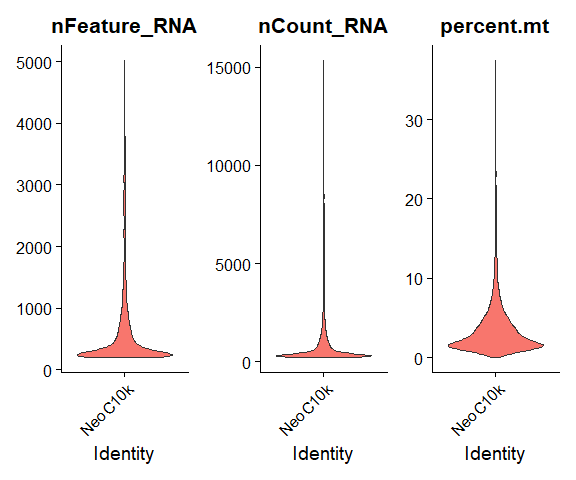<!-- -->

``` r
plot1 <- FeatureScatter(neocortex, feature1 = "nCount_RNA", feature2 = "percent.mt")
plot2 <- FeatureScatter(neocortex, feature1 = "nCount_RNA", feature2 = "nFeature_RNA")
plot1 + plot2
```

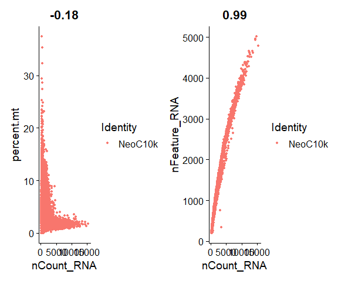<!-- -->

``` r
dim(neocortex)
#> [1] 21634 12594
```

## Filtering

We retain cells expressing a minimum of 200 genes. From the previous
plots, it seems that cells expressing more than 2500 genes are
artifacts. They could be doublets. Moreover, we eliminate empty droplets
by setting a lower limit of 200 genes per cell. Next, we set a threshold
for cells containing a percentage of mitochondrial counts equal to 10% 
(since it's a complesx tissue, thus may be more metabolically demanding than other tissues),,
to filter out low quality or damaged cells.

``` r
neocortex <- subset(neocortex, subset = nFeature_RNA > 200 & nFeature_RNA < 2500  & percent.mt < 10 & nCount_RNA < 3000)
dim(neocortex)
#> [1] 21634 10711
```

## Normalization

By default, Seaurat implies a LogNormalization,where feature counts for
each cell are dividev by the total counts for that cell and multiplied
by 10.000, to improve the interpretability of the data. Also, we find
the 2000 most meaningful genes.

``` r
neocortex <- NormalizeData(neocortex, normalization.method = "LogNormalize", scale.factor = 10000)
#choose the more meaningful genes: most variable genes wrt average across cells
neocortex <- FindVariableFeatures(neocortex, selection.method = "vst", nfeatures = 4000)
```

VariableFeatures is applied to get variable genes information.
FindVariableFeatures function identified the most variable ones on the
mean variability plot. In this case, we chose “vst” method, fitting a
line for the relationship between log(variance) and log(mean) with local
polynomial regression and standardizing the feature values using the
observed mean and expected variance. We thus identified the 10 most
variable genes.

``` r
top10 <- head(VariableFeatures(neocortex), 10)
top10
#>  [1] "Npy"    "Plp1"   "Vip"    "Sst"    "Ptgds"  "Lyz2"   "Mal"    "Cnp"   
#>  [9] "Cldn11" "Apod"
```

Plot variable features with and without labels.

``` r
plot1 <- VariableFeaturePlot(neocortex)
plot2 <- LabelPoints(plot = plot1, points = top10, repel = TRUE)
#> When using repel, set xnudge and ynudge to 0 for optimal results
plot2
#> Warning: Transformation introduced infinite values in continuous x-axis
```

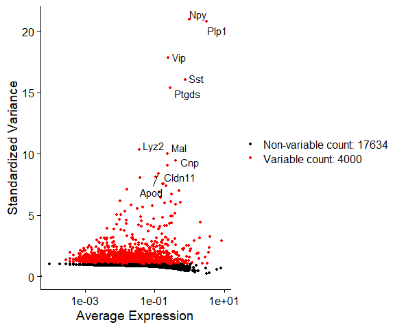<!-- -->

Data Visualization after filtering.

``` r
VlnPlot(neocortex, features = c("nFeature_RNA", "nCount_RNA", "percent.mt"), ncol = 3, pt.size=0)
```

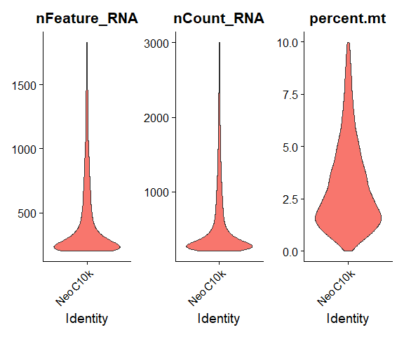<!-- -->

## Data scaling

We proceeded scaling data as recommended by Seurat guidelines.

``` r
all.genes <- rownames(neocortex)
neocortex <- ScaleData(neocortex, features = all.genes)
#> Centering and scaling data matrix
head(neocortex[["RNA"]]@scale.data[1,])
#> AAACATACACCTCC AAACATACCATGAC AAACATACCTCATT AAACATACGCTAAC AAACATACTCTATC 
#>     -0.1322456     -0.1322456     -0.1322456     -0.1322456     -0.1322456 
#> AAACATACTCTGGA 
#>     -0.1322456
```

## Cell cycle

First, we assign each cell a score, based on its expression of G2/M and
S phase markers. These marker sets should be anticorrelated in their
expression levels, and cells expressing neither are likely not cycling
and in G1 phase.

We assign scores in the CellCycleScoring function, which stores S and
G2/M scores in object meta data, along with the predicted classification
of each cell in either G2M, S or G1 phase.

``` r

cc.genes
#> $s.genes
#>  [1] "MCM5"     "PCNA"     "TYMS"     "FEN1"     "MCM2"     "MCM4"    
#>  [7] "RRM1"     "UNG"      "GINS2"    "MCM6"     "CDCA7"    "DTL"     
#> [13] "PRIM1"    "UHRF1"    "MLF1IP"   "HELLS"    "RFC2"     "RPA2"    
#> [19] "NASP"     "RAD51AP1" "GMNN"     "WDR76"    "SLBP"     "CCNE2"   
#> [25] "UBR7"     "POLD3"    "MSH2"     "ATAD2"    "RAD51"    "RRM2"    
#> [31] "CDC45"    "CDC6"     "EXO1"     "TIPIN"    "DSCC1"    "BLM"     
#> [37] "CASP8AP2" "USP1"     "CLSPN"    "POLA1"    "CHAF1B"   "BRIP1"   
#> [43] "E2F8"    
#> 
#> $g2m.genes
#>  [1] "HMGB2"   "CDK1"    "NUSAP1"  "UBE2C"   "BIRC5"   "TPX2"    "TOP2A"  
#>  [8] "NDC80"   "CKS2"    "NUF2"    "CKS1B"   "MKI67"   "TMPO"    "CENPF"  
#> [15] "TACC3"   "FAM64A"  "SMC4"    "CCNB2"   "CKAP2L"  "CKAP2"   "AURKB"  
#> [22] "BUB1"    "KIF11"   "ANP32E"  "TUBB4B"  "GTSE1"   "KIF20B"  "HJURP"  
#> [29] "CDCA3"   "HN1"     "CDC20"   "TTK"     "CDC25C"  "KIF2C"   "RANGAP1"
#> [36] "NCAPD2"  "DLGAP5"  "CDCA2"   "CDCA8"   "ECT2"    "KIF23"   "HMMR"   
#> [43] "AURKA"   "PSRC1"   "ANLN"    "LBR"     "CKAP5"   "CENPE"   "CTCF"   
#> [50] "NEK2"    "G2E3"    "GAS2L3"  "CBX5"    "CENPA"
s.genes <- cc.genes$s.genes
g2m.genes <- cc.genes$g2m.genes
neocortex <- CellCycleScoring(neocortex, s.features = s.genes, g2m.features = g2m.genes, set.ident = TRUE)
#> Warning: The following features are not present in the object: MCM5, PCNA,
#> TYMS, FEN1, MCM2, MCM4, RRM1, UNG, GINS2, MCM6, CDCA7, DTL, PRIM1, UHRF1,
#> MLF1IP, HELLS, RFC2, RPA2, NASP, RAD51AP1, GMNN, WDR76, SLBP, CCNE2, UBR7,
#> POLD3, MSH2, ATAD2, RAD51, RRM2, CDC45, CDC6, EXO1, TIPIN, DSCC1, BLM,
#> CASP8AP2, USP1, CLSPN, POLA1, CHAF1B, BRIP1, E2F8, not searching for symbol
#> synonyms
#> Warning: The following features are not present in the object: HMGB2, CDK1,
#> NUSAP1, UBE2C, BIRC5, TPX2, TOP2A, NDC80, CKS2, NUF2, CKS1B, MKI67, TMPO,
#> CENPF, TACC3, FAM64A, SMC4, CCNB2, CKAP2L, CKAP2, AURKB, BUB1, KIF11, ANP32E,
#> TUBB4B, GTSE1, KIF20B, HJURP, CDCA3, HN1, CDC20, TTK, CDC25C, KIF2C, RANGAP1,
#> NCAPD2, DLGAP5, CDCA2, CDCA8, ECT2, KIF23, HMMR, AURKA, PSRC1, ANLN, LBR,
#> CKAP5, CENPE, CTCF, NEK2, G2E3, GAS2L3, CBX5, CENPA, not searching for symbol
#> synonyms
#> Warning in AddModuleScore(object = object, features = features, name = name, :
#> Could not find enough features in the object from the following feature lists:
#> S.Score Attempting to match case...Could not find enough features in the object
#> from the following feature lists: G2M.Score Attempting to match case...
head(neocortex)
#>                orig.ident nCount_RNA nFeature_RNA percent.mt      S.Score
#> AAACATACACCTCC    NeoC10k        241          212  7.4688797  0.096635080
#> AAACATACCATGAC    NeoC10k       1444          939  1.3850416 -0.024890363
#> AAACATACCTCATT    NeoC10k        698          556  0.1432665 -0.033261626
#> AAACATACGCTAAC    NeoC10k        333          292  1.2012012  0.081648073
#> AAACATACTCTATC    NeoC10k        738          551  1.4905149 -0.016097797
#> AAACATACTCTGGA    NeoC10k        235          211  2.5531915 -0.005042061
#> AAACATTGACAGTC    NeoC10k        348          275  1.7241379 -0.011330481
#> AAACATTGACGGTT    NeoC10k        286          248  4.8951049 -0.004786302
#> AAACATTGCTGGAT    NeoC10k        257          238  1.1673152 -0.014776111
#> AAACATTGGAGGGT    NeoC10k        708          509  0.5649718 -0.021773966
#>                  G2M.Score Phase old.ident
#> AAACATACACCTCC -0.03318016     S   NeoC10k
#> AAACATACCATGAC -0.08471385    G1   NeoC10k
#> AAACATACCTCATT  0.06431255   G2M   NeoC10k
#> AAACATACGCTAAC  0.03090057     S   NeoC10k
#> AAACATACTCTATC -0.06309849    G1   NeoC10k
#> AAACATACTCTGGA  0.04297024   G2M   NeoC10k
#> AAACATTGACAGTC  0.04274713   G2M   NeoC10k
#> AAACATTGACGGTT -0.02983902    G1   NeoC10k
#> AAACATTGCTGGAT -0.03297939    G1   NeoC10k
#> AAACATTGGAGGGT -0.05129453    G1   NeoC10k
```

## Dimensionality reduction

Now we run a principal component analysis to find the main responsible
for variability in the dataset. Here we get the most significative up
and down regulated genes for each principal component.

``` r
neocortex <- RunPCA(neocortex, features = VariableFeatures(object = neocortex))
#> PC_ 1 
#> Positive:  Clstn1, Meg3, Syp, Snhg11, App, Serinc1, Gria2, Chgb, Atp1a1, Scn2a1 
#>     Slc17a7, Atp1b1, Atp6v0b, Cx3cl1, Scg5, Faim2, Aplp1, Rtn1, Grin2b, Slc22a17 
#>     Atp2b2, Nptn, Atp2a2, Syt1, Gpm6a, Gabbr1, Ptprn, Atp2b1, Clstn3, Lingo1 
#> Negative:  Ctss, C1qa, Sparc, C1qc, C1qb, P2ry12, Tyrobp, Tmsb4x, Selplg, Tmem119 
#>     Fcer1g, hexb, Csf1r, Cyba, Fcgr3, Apoe, Gpr34, Pld4, Ly86, Lpcat2 
#>     Trem2, Cd53, Cx3cr1, Fcrls, Aif1, Ltc4s, Laptm5, Glul, Rnase4, Vsir 
#> PC_ 2 
#> Positive:  Rtn1, Scg5, Cck, Snhg11, Scn1b, Meg3, Grin2b, Atp2b1, Ly6h, Tmem59l 
#>     Syp, Npy, Nsg1, Chgb, Caly, Sst, 2900055J20Rik, Olfm1, Atp1b1, RP23-35N23.2 
#>     Grin2a, Lamp5, Calb1, Vgf, Syt1, Slc17a7, Scn2a1, Ahi1, Lingo1, Mal2 
#> Negative:  Id3, Slco1c1, Gng11, Cldn5, Ly6c1, Cd81, Flt1, Klf2, Itm2a, Sparc 
#>     Car2, Glul, Ly6a, Gng5, Slc2a1, Id1, Cd63, Pglyrp1, Atp1a2, S100a16 
#>     Qk, Mfge8, Esam, Ifitm3, Arpc1b, Rgcc, Vwa1, Fcgrt, Tm4sf1, Myl12a 
#> PC_ 3 
#> Positive:  Plpp3, Gpr37l1, Aldoc, Cldn10, Btbd17, Slc1a3, Ntsr2, Bcan, Mfge8, Htra1 
#>     Pla2g7, Atp1a2, Apoe, Gja1, F3, Clu, Acsbg1, Prdx6, Tsc22d4, Cd63 
#>     Gjb6, Hes5, Mlc1, Mt1, Scrg1, Cxcl14, Slc1a2, Igfbp2, Mmd2, Cmtm5 
#> Negative:  Cldn5, Ly6c1, Itm2a, Klf2, Flt1, Sparc, Ly6a, Pglyrp1, Igfbp7, Esam 
#>     Slco1a4, Car4, Vwa1, Tm4sf1, Ptprb, Anxa3, Abcb1a, Ifitm3, Cxcl12, Hspb1 
#>     Srgn, Slc22a8, AC092855.1, Sox17, Ctla2a, Id1, Ctsh, Kank3, Rgs5, Ly6e 
#> PC_ 4 
#> Positive:  Cldn5, Ly6c1, Itm2a, Flt1, Ly6a, Pglyrp1, Esam, Klf2, Id1, Id3 
#>     Slco1a4, Igfbp7, Tm4sf1, Abcb1a, Vwa1, Rgs5, Ptprb, Hspb1, Ifitm3, Cxcl12 
#>     Slc22a8, Sox17, Car4, Ctla2a, Slco1c1, Wfdc1, Slc2a1, Nostrin, Emcn, Foxq1 
#> Negative:  C1qa, P2ry12, C1qc, Ctss, C1qb, Tmem119, hexb, Selplg, Csf1r, Tyrobp 
#>     Fcer1g, Fcgr3, Gpr34, Cx3cr1, Pld4, Lgmn, Lpcat2, Fcrls, Cd53, Ly86 
#>     Trem2, Laptm5, Cd68, Aif1, Vsir, Ltc4s, Ifngr1, Olfml3, Ctsd, Rnase4 
#> PC_ 5 
#> Positive:  Cldn11, Mag, Mog, Gjb1, Mal, Opalin, Apod, Fa2h, Ermn, Gsn 
#>     Ppp1r14a, Tspan2, Aspa, Plp1, Gpr37, Hapln2, Trf, Nkx6-2, Ptgds, Gjc2 
#>     Cnp, RP23-142A14.3, Tmem88b, Grb14, Pdlim2, Qdpr, Tmem125, Insc, Sept4, Lpar1 
#> Negative:  Cst3, Mfge8, Atp1a2, Plpp3, Cldn10, Btbd17, Gpr37l1, Clu, Gja1, Htra1 
#>     Pla2g7, Slc1a2, Slc1a3, Ntsr2, F3, Apoe, Bcan, Aldoc, Gjb6, Atp1b2 
#>     Acsbg1, Fjx1, Sparcl1, S1pr1, Igfbp2, Eva1a, Fgfr3, Cspg5, Tspan7, Fam181b
neocortex[["pca"]] # MOST VARIABLE FREATURES
#> A dimensional reduction object with key PC_ 
#>  Number of dimensions: 50 
#>  Projected dimensional reduction calculated:  FALSE 
#>  Jackstraw run: FALSE 
#>  Computed using assay: RNA
print(neocortex[["pca"]], dims = 1:5, nfeatures = 5)
#> PC_ 1 
#> Positive:  Clstn1, Meg3, Syp, Snhg11, App 
#> Negative:  Ctss, C1qa, Sparc, C1qc, C1qb 
#> PC_ 2 
#> Positive:  Rtn1, Scg5, Cck, Snhg11, Scn1b 
#> Negative:  Id3, Slco1c1, Gng11, Cldn5, Ly6c1 
#> PC_ 3 
#> Positive:  Plpp3, Gpr37l1, Aldoc, Cldn10, Btbd17 
#> Negative:  Cldn5, Ly6c1, Itm2a, Klf2, Flt1 
#> PC_ 4 
#> Positive:  Cldn5, Ly6c1, Itm2a, Flt1, Ly6a 
#> Negative:  C1qa, P2ry12, C1qc, Ctss, C1qb 
#> PC_ 5 
#> Positive:  Cldn11, Mag, Mog, Gjb1, Mal 
#> Negative:  Cst3, Mfge8, Atp1a2, Plpp3, Cldn10
```

``` r
VizDimLoadings(neocortex, dims = 1:2, reduction = "pca")
```
<p align="center">
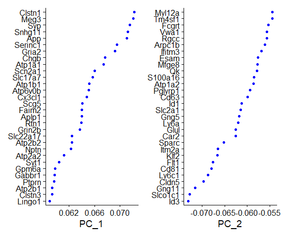<!-- -->
</p>
The following step is to determine whether cell cycle is a
clusterization factor.

``` r
DimPlot(neocortex, reduction = "pca")
```

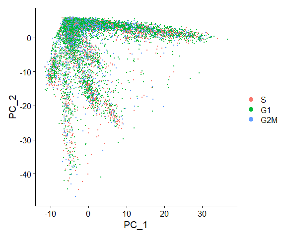<!-- -->

Cell cycle seems not to be a key factor in grouping of the cells. Hence,
we don’t have to remove this factor we are taking into account for
subsequent analyses.

``` r
DimPlot(neocortex, reduction = "pca", dims = c(3,4))
```

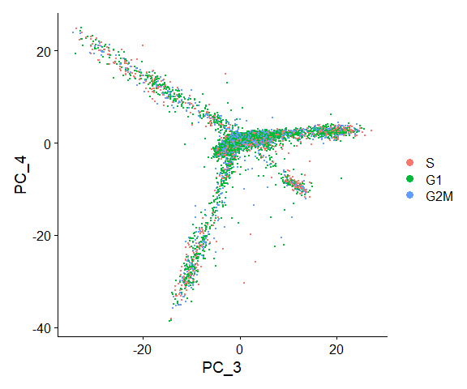<!-- -->

``` r
DimHeatmap(neocortex, dims = 1, cells = 500, balanced = TRUE)
```

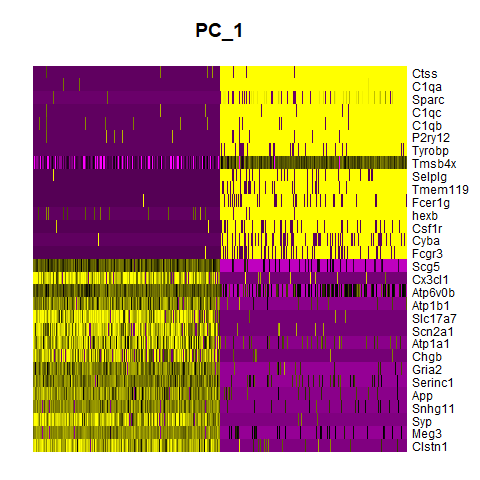<!-- -->

It looks like there are some genes with a difference of expression
across the most variable cells. Let’s have a look to the other PCs:

``` r
DimHeatmap(neocortex, dims = 1:9, cells = 500, balanced = TRUE)
```

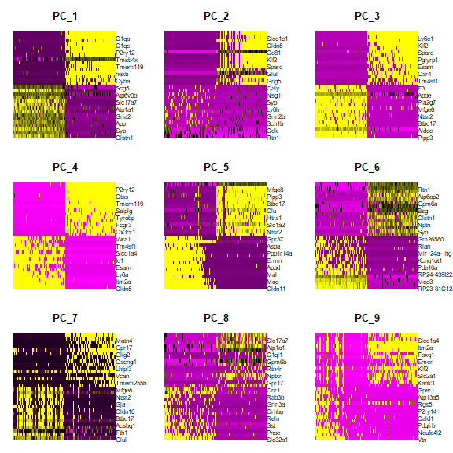<!-- -->

To determine the optimal number of dimension, we produce a Elbow plot,
showing the standard deviations for each principal component.

``` r
ElbowPlot(neocortex, ndims = 50)
```

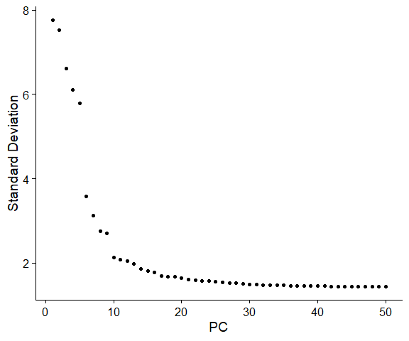<!-- -->

We observed the presence of the “elbow” around 16,thus we decided to try
to perform a first exploratory clustering with values from 10 to 20.
However, the clustering with 10,16 and 20 were sub-optimal in subsequent
cell characterization.

Seurat computes the k nearest neighbors for our dataset, based on
Euclidean distance in PCA space and definition of edge weights between
any two cells based on shared overlap in their local neighborhoods
(Jaccard similarity), optimized with Louvain algorithm and defining the
desired resultion of the clusters. Resolution, a parameter to define the
granularity of the components, was evaluated from 0.4 till 2. However,
selecting the best parameters was a delicate task due to the thin line
between addressing a sub-cellular type and signal noise. Here only
analyses conducted on 10 and 40 dimensions are reported.

``` r
neocortex10  <- FindNeighbors(neocortex, dims = 1:10)
#> Computing nearest neighbor graph
#> Computing SNN
neocortex10 <- FindClusters(neocortex10, resolution = 0.5) 
#> Modularity Optimizer version 1.3.0 by Ludo Waltman and Nees Jan van Eck
#> 
#> Number of nodes: 10711
#> Number of edges: 346432
#> 
#> Running Louvain algorithm...
#> Maximum modularity in 10 random starts: 0.9184
#> Number of communities: 16
#> Elapsed time: 1 seconds

```
Reporting number of cells per cluster:
```
summary(neocortex10@meta.data$seurat_clusters)
#>    0    1    2    3    4    5    6    7    8    9   10   11   12   13   14   15 
#> 2911 1367 1322  888  879  561  481  407  393  335  326  244  236  192  145   24
```

Plot the clusters:

``` r
DimPlot(neocortex10, reduction = "pca")
```

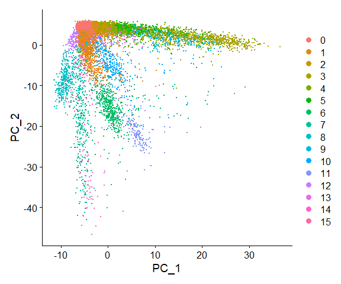<!-- -->

We can appreciate that cells clustered together were localized close to
each other in the 2D plot representation.

However, we knew that this was only an approximation due to the fact
that there are also other components to consider.

## Clustering visualization UMAP

UMAP alghoritm had been implied to improve the representation of the
clusters.

``` r
neocortex <- RunUMAP(neocortex10, dims = 1:10)
#> Warning: The default method for RunUMAP has changed from calling Python UMAP via reticulate to the R-native UWOT using the cosine metric
#> To use Python UMAP via reticulate, set umap.method to 'umap-learn' and metric to 'correlation'
#> This message will be shown once per session
#> 10:30:15 UMAP embedding parameters a = 0.9922 b = 1.112
#> 10:30:15 Read 10711 rows and found 10 numeric columns
#> 10:30:15 Using Annoy for neighbor search, n_neighbors = 30
#> 10:30:15 Building Annoy index with metric = cosine, n_trees = 50
#> 0%   10   20   30   40   50   60   70   80   90   100%
#> [----|----|----|----|----|----|----|----|----|----|
#> **************************************************|
#> 10:30:16 Writing NN index file to temp file C:\Users\Mirco\AppData\Local\Temp\Rtmpop43kR\file15d862065c26
#> 10:30:16 Searching Annoy index using 1 thread, search_k = 3000
#> 10:30:19 Annoy recall = 100%
#> 10:30:20 Commencing smooth kNN distance calibration using 1 thread with target n_neighbors = 30
#> 10:30:20 Initializing from normalized Laplacian + noise (using irlba)
#> 10:30:21 Commencing optimization for 200 epochs, with 453814 positive edges
#> 10:30:30 Optimization finished
DimPlot(neocortex, reduction = "umap")
```

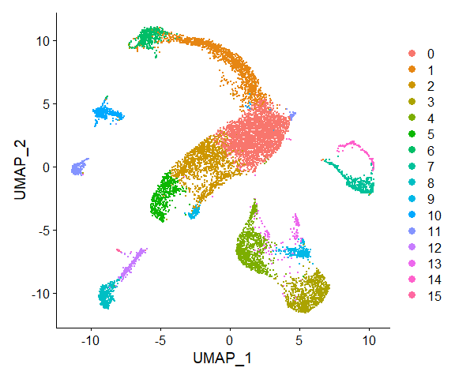<!-- -->

## Finding DE genes

The final step is to give a rationale to the clusters. That is, find
which are the “marker genes” (expressed exclusively, or at least
over-expressed) in each cluster with respect to the others. Then, trying
to figure out, according to the marker genes of each cluster, what could
be the corresponding cell type.

By default, Seurat perform this step with a non-parametric test - which
is the most suitable choice, since each cluster is made of a quite large
number of cells and is hard to assume that data are normally
distributed. We can find the “differentially expressed genes” for a
cluster against the others, with the additional condition that the gene
has to be expressed in at least the 25% of the cells in the cluster:

``` r
neocortex.mark_wilcox <- FindAllMarkers(neocortex, only.pos = TRUE, 
                                        min.pct = 0.25, logfc.threshold = 0.25)
#> Calculating cluster 0
#> Calculating cluster 1
#> Calculating cluster 2
#> Calculating cluster 3
#> Calculating cluster 4
#> Calculating cluster 5
#> Calculating cluster 6
#> Calculating cluster 7
#> Calculating cluster 8
#> Calculating cluster 9
#> Calculating cluster 10
#> Calculating cluster 11
#> Calculating cluster 12
#> Calculating cluster 13
#> Calculating cluster 14
#> Calculating cluster 15
```

To ensure a better comprehension of the biological background, a
bibliographic research was conducted. From Hrvatin et al (2018), a
series of known marker genes were added to better evaluate the
clustering, and to double check the findings of the analyses.

``` r
marker_genes <- neocortex.mark_wilcox %>% group_by(cluster) %>% top_n(n = 1, wt = avg_log2FC)
marker_genesNCBI <- c("Slc17a7","Gad1", "Olig1","Aldoc", "Cldn5", "Vtn", "Cx3cr1","Aif1","Mrc1")
marker_genes
#> # A tibble: 16 × 7
#> # Groups:   cluster [16]
#>        p_val avg_log2FC pct.1 pct.2 p_val_adj cluster gene        
#>        <dbl>      <dbl> <dbl> <dbl>     <dbl> <fct>   <chr>       
#>  1 7.83e- 30      1.48  0.386 0.319 1.69e- 25 0       Mbp         
#>  2 0              2.95  0.86  0.187 0         1       Aldoc       
#>  3 5.01e- 20      0.939 0.329 0.249 1.08e- 15 2       Atp1b1      
#>  4 0              2.33  0.887 0.181 0         3       Atp1a1      
#>  5 0              4.25  0.901 0.209 0         4       RP23-81C12.1
#>  6 8.53e-186      2.18  0.66  0.185 1.84e-181 5       Clstn1      
#>  7 0              3.90  0.925 0.046 0         6       Mfge8       
#>  8 0              5.52  0.902 0.012 0         7       Cldn5       
#>  9 0              5.76  1     0.046 0         8       hexb        
#> 10 9.41e-123      4.69  0.26  0.027 2.04e-118 9       Vip         
#> 11 0              4.19  0.644 0.004 0         10      C1ql1       
#> 12 0              7.40  0.975 0.094 0         11      Plp1        
#> 13 3.48e-300      3.15  0.653 0.051 7.53e-296 12      Ctss        
#> 14 0              2.81  0.26  0.001 0         13      Igfbpl1     
#> 15 0              6.36  0.903 0.005 0         14      Vtn         
#> 16 0              6.58  1     0.004 0         15      Lyz2
```

``` r
VlnPlot(neocortex, features = marker_genes$gene , pt.size = 0)
```

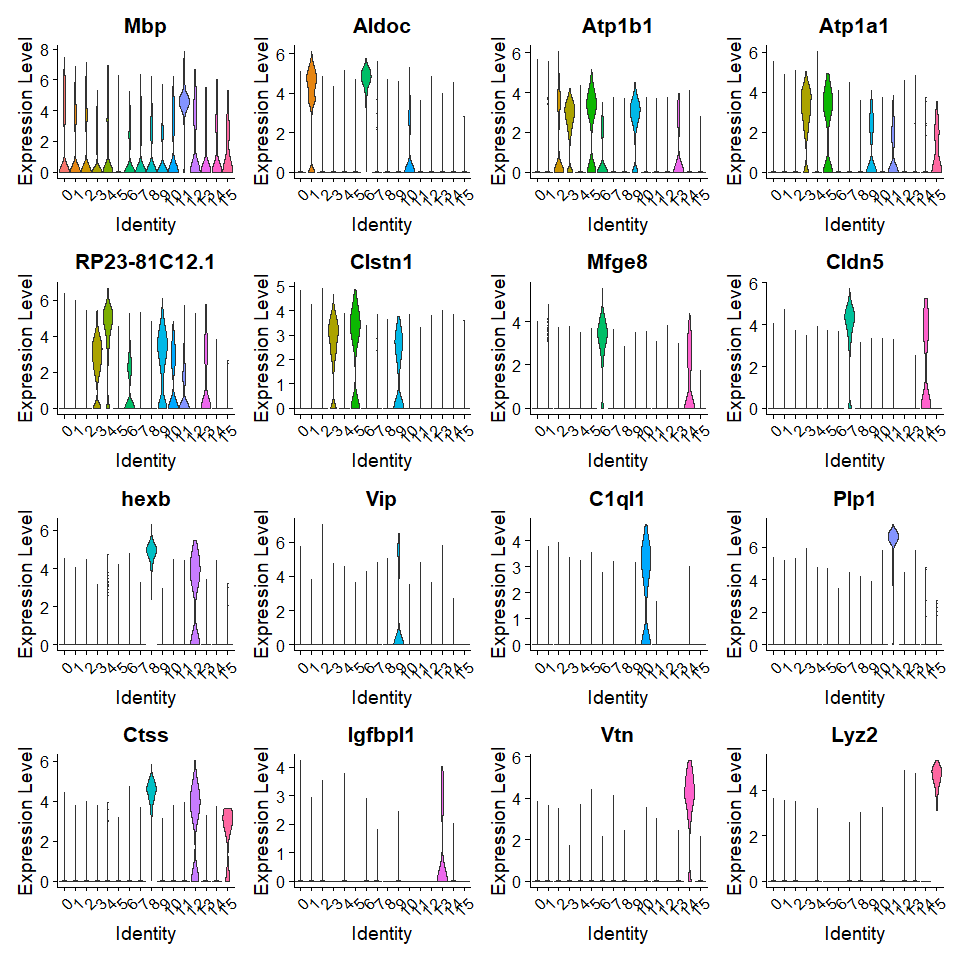<!-- -->

## Reclustering

With 40 dimensions and resolution of 0.5 we obtained more clusters, and
thus, more data to explore.

``` r
neocortex40 <- FindNeighbors(neocortex, dims = 1:40)
#> Computing nearest neighbor graph
#> Computing SNN
neocortex40 <- FindClusters(neocortex40, resolution = 0.9)
#> Modularity Optimizer version 1.3.0 by Ludo Waltman and Nees Jan van Eck
#> 
#> Number of nodes: 10711
#> Number of edges: 449013
#> 
#> Running Louvain algorithm...
#> Maximum modularity in 10 random starts: 0.8718
#> Number of communities: 19
#> Elapsed time: 1 seconds
summary(neocortex40@meta.data$seurat_clusters)
#>    0    1    2    3    4    5    6    7    8    9   10   11   12   13   14   15 
#> 2492 1270  898  884  855  581  563  513  400  362  322  320  309  261  191  169 
#>   16   17   18 
#>  165  133   23
```

``` r
neocortex40 <- RunUMAP(neocortex40, dims = 1:40)
#> 10:31:42 UMAP embedding parameters a = 0.9922 b = 1.112
#> 10:31:42 Read 10711 rows and found 40 numeric columns
#> 10:31:42 Using Annoy for neighbor search, n_neighbors = 30
#> 10:31:42 Building Annoy index with metric = cosine, n_trees = 50
#> 0%   10   20   30   40   50   60   70   80   90   100%
#> [----|----|----|----|----|----|----|----|----|----|
#> **************************************************|
#> 10:31:43 Writing NN index file to temp file C:\Users\Mirco\AppData\Local\Temp\Rtmpop43kR\file15d86b1232c
#> 10:31:43 Searching Annoy index using 1 thread, search_k = 3000
#> 10:31:46 Annoy recall = 100%
#> 10:31:46 Commencing smooth kNN distance calibration using 1 thread with target n_neighbors = 30
#> 10:31:47 Initializing from normalized Laplacian + noise (using irlba)
#> 10:31:47 Commencing optimization for 200 epochs, with 510030 positive edges
#> 10:31:58 Optimization finished
DimPlot(neocortex40, reduction = "umap")
```

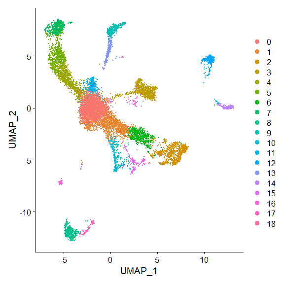<!-- -->

``` r
neocortex.mark40<- FindAllMarkers(neocortex40, only.pos = TRUE, 
                                        min.pct = 0.25,  logfc.threshold = 0.25)
#> Calculating cluster 0
#> Calculating cluster 1
#> Calculating cluster 2
#> Calculating cluster 3
#> Calculating cluster 4
#> Calculating cluster 5
#> Calculating cluster 6
#> Calculating cluster 7
#> Calculating cluster 8
#> Calculating cluster 9
#> Calculating cluster 10
#> Calculating cluster 11
#> Calculating cluster 12
#> Calculating cluster 13
#> Calculating cluster 14
#> Calculating cluster 15
#> Calculating cluster 16
#> Calculating cluster 17
#> Calculating cluster 18
top_genes <- neocortex.mark40 %>% group_by(cluster) %>% top_n(n = 1, wt = avg_log2FC)
top_genes
#> # A tibble: 19 × 7
#> # Groups:   cluster [19]
#>        p_val avg_log2FC pct.1 pct.2 p_val_adj cluster gene        
#>        <dbl>      <dbl> <dbl> <dbl>     <dbl> <fct>   <chr>       
#>  1 2.01e- 26      0.947 0.38  0.345 4.35e- 22 0       Sncb        
#>  2 1.07e- 25      0.863 0.428 0.328 2.31e- 21 1       Atp2b1      
#>  3 0              2.32  0.885 0.18  0         2       Atp1a1      
#>  4 0              4.30  0.908 0.208 0         3       RP23-81C12.1
#>  5 1.25e-273      1.81  0.77  0.23  2.71e-269 4       Aldoc       
#>  6 0              2.96  0.966 0.233 0         5       Aldoc       
#>  7 1.49e-262      2.16  0.989 0.524 3.23e-258 6       Rtn1        
#>  8 0              3.95  0.908 0.044 0         7       Mfge8       
#>  9 0              5.53  0.912 0.013 0         8       Cldn5       
#> 10 0              5.59  0.997 0.049 0         9       hexb        
#> 11 1.11e-219      4.85  0.711 0.139 2.40e-215 10      Sst         
#> 12 4.33e-226      4.00  0.963 0.318 9.36e-222 11      Mbp         
#> 13 0              4.22  0.663 0.005 0         12      C1ql1       
#> 14 0              3.38  0.682 0.049 0         13      Ctss        
#> 15 0              7.43  1     0.098 0         14      Plp1        
#> 16 0              6.42  0.669 0.024 0         15      Vip         
#> 17 0              3.09  0.321 0.001 0         16      Igfbpl1     
#> 18 0              6.40  0.925 0.005 0         17      Vtn         
#> 19 0              6.62  1     0.004 0         18      Lyz2
```

## Cells labelling

Finally,a cell type to each cluster was assigned by means of its
specific marker genes we had previously identified both in the analyses
and in literature.

``` r
new.cluster.ids <- c("Inhib. Neurons1", "Neurons", "Exc. Neurons", "Batch effect", "Astrocyte", "Astrocyte", 
                     "Exc. Neurons", "Fibroblasts", "EC","Microglia","Inhib. Neurons2",
                     "Oligo1","OPC","Macrophages","Oligo2","Inhib. Neurons2","NPC","Pericytes","Macrophages2")
#EC = Endothelial cells
#Inhib. = Inhibitory | Exc. = Excitatory
#OPC = Oligodendrocyte’s progenitor cells
#NPC = Neuronal Progenitor Cells

names(new.cluster.ids) <- levels(neocortex40)
neocortex40 <- RenameIdents(neocortex40, new.cluster.ids)
DimPlot(neocortex40, reduction = "umap", label = TRUE, pt.size = 0.5) + NoLegend()
```

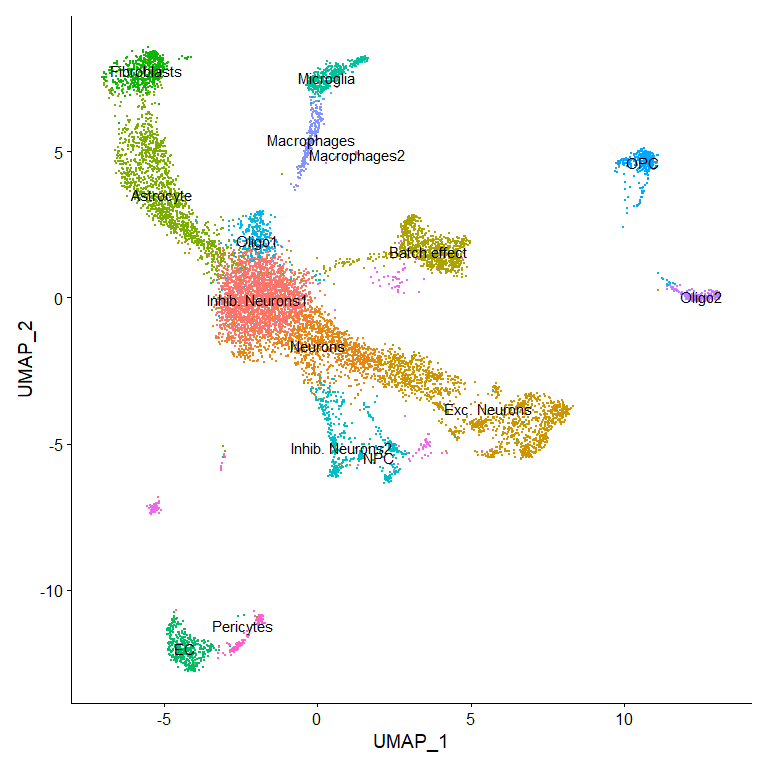<!-- -->

## Appendix

### Marker genes reference 

| Cluster number | Putative Cell Type                      | Marker Gene (Gene Symbol)    | Evidence                                      |
|----------------|----------------------------------------|-----------------------------|-----------------------------------------------|
| 0              | Inhibitory neurons1                     | Sncb+ Pvalb                 | PanglaoDB “markers”                           |
| 1              | Neurons                                 | Atp2b1                      | PanglaoDB “markers”                           |
| 2              | Excitatory neurons                      | Atpa1, Slc17a7              | PMC5742025                                    |
| 3              | Batch effect (rRNA contamination)       | RP23-81C12.1 (Gm26917 )     | Genome browser + MGI + Yale Liu, 2020         |
| 4              | Astrocyte                               | Aldoc                       | PMC5742025                                    |
| 5              | Astrocyte                               | Synpr                       | ProteinAtlas                                  |
| 6              | Excitatory neurons                      | Rtn1, Slc17a7               | PMC5742025                                    |
| 7              | Fibroblasts                             | Mfge8                       | PanglaoDB “markers”                           |
| 8              | Endothelial cells                       | Cldn5                       | PanglaoDB “markers” + PMC5742025              |
| 9              | Microglia                               | Cx3cr1 ,hexb, Ctss          | PMC5742025+ PanglaoDB “markers”              |
| 10             | Inhibitory neurons2                     | Sst                         | PMC3556905                                    |
| 11             | Oligodendrocytes1                       | Mbp                         | PMC5742025 + PanglaoDB “markers”              |
| 12             | Oligodendrocyte’s progenitor cells      | C1ql1, Olig1               | PanglagoDB “markers”                          |
| 13             | Macrophages                             | Ctss                        | PanglaoDB “markers”                           |
| 14             | Oligodendrocytes2                       | Plp1, Olig1                | PanglaoDB “markers” + PMC5742025              |
| 15             | Inhibitory neurons2                     | Vip                         | PMC4315827                                    |
| 16             | Neuronal Progenitor Cells                | Ifgbpl-1                   | PMC5794803                                    |
| 17             | Pericytes                               | Vtn + Pdgfrb               | PanglaoDB “markers”                           |
| 18             | Macrophages2                            | Lyz2, Mrc1                 | PanglaoDB “markers” + PMC5742025              |


Graphical representation of gene expression per cell cluster are
reported below, both representing the findings of the project and the
literature ones.

``` r
VlnPlot(neocortex40, features = c(top_genes$gene) , pt.size = 0)
```

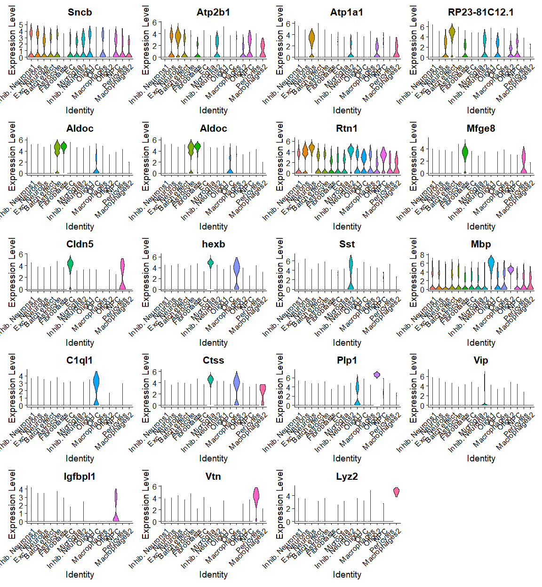<!-- -->

``` r
VlnPlot(neocortex40, features = marker_genesNCBI, pt.size=0)
```

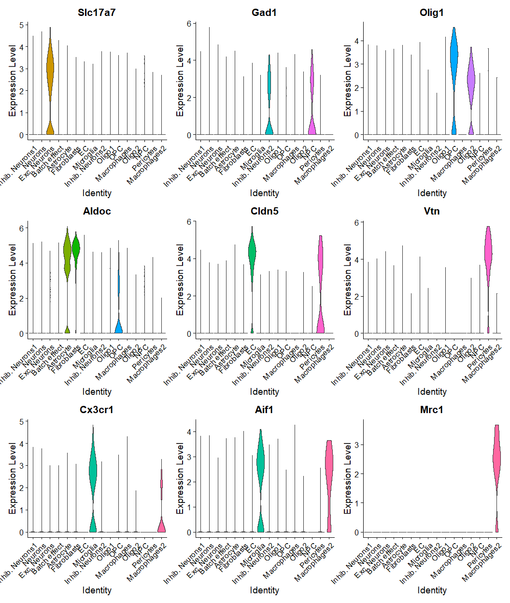<!-- -->

``` r
DoHeatmap(neocortex40, features = top_genes$gene) + NoLegend()
```

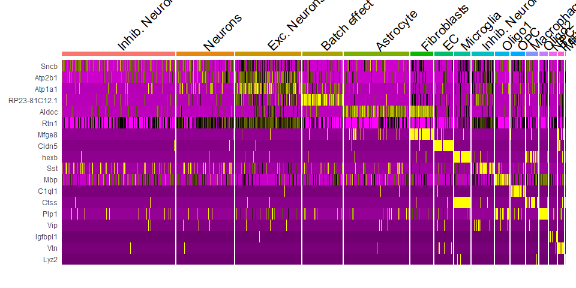<!-- -->

``` r
FeaturePlot(neocortex40, features = top_genes$gene)
```

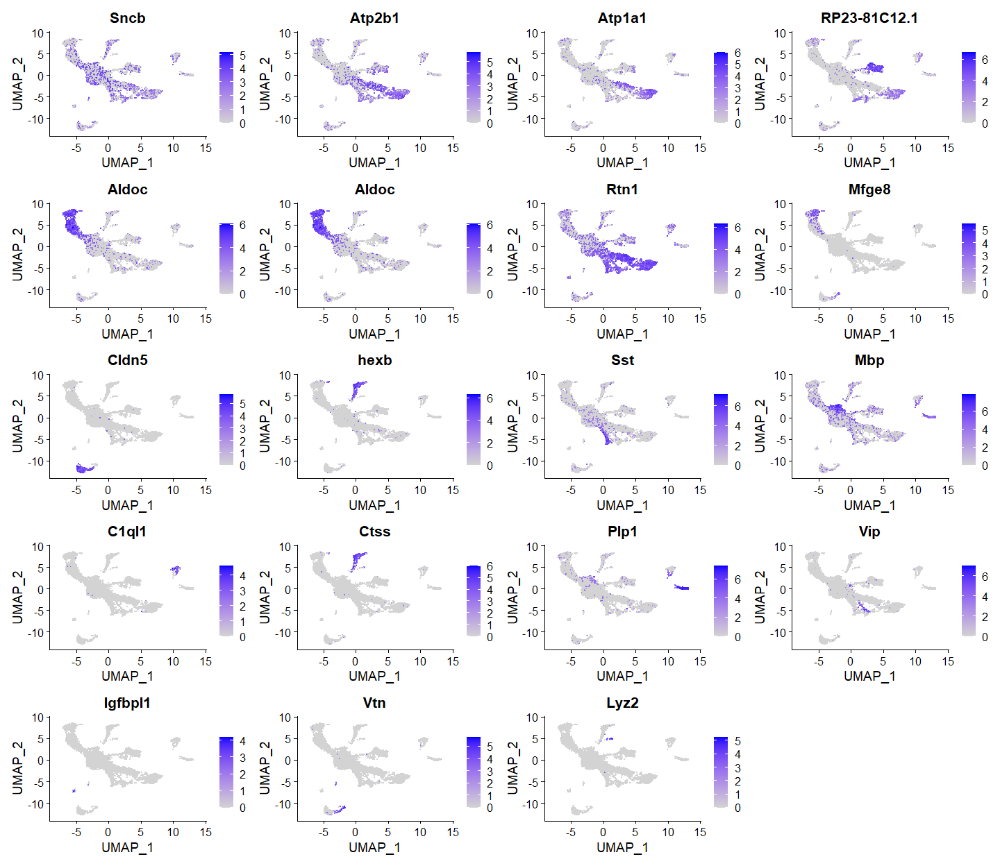<!-- -->

``` r
FeaturePlot(neocortex40, features = marker_genesNCBI)
```

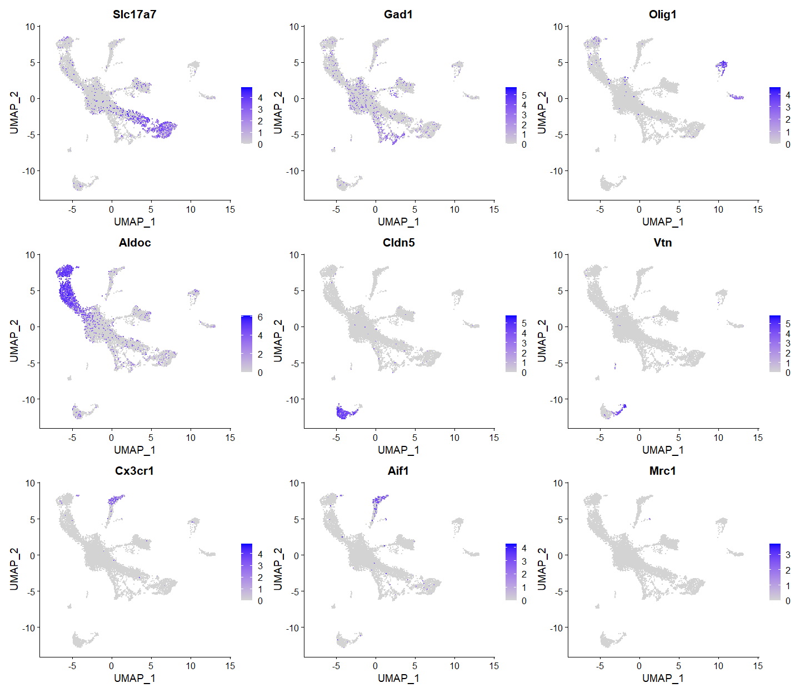<!-- -->
